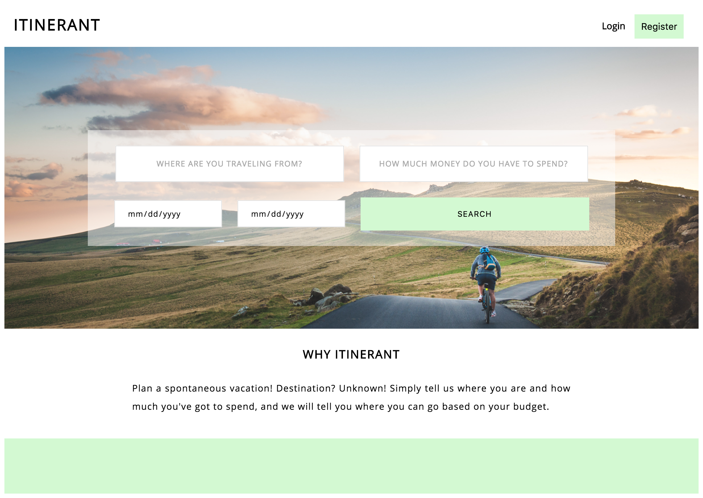
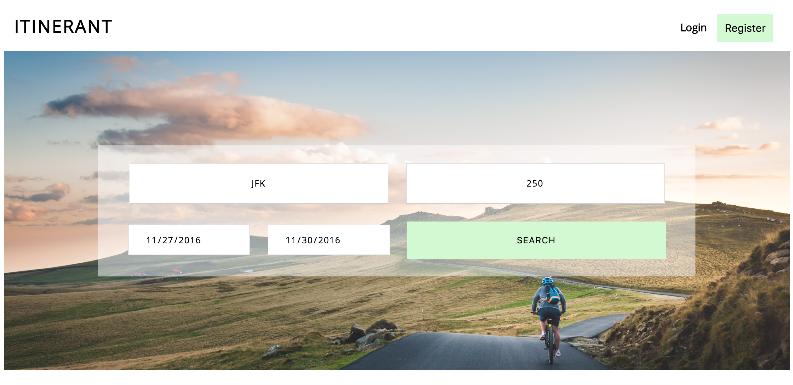
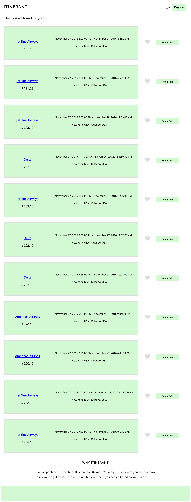

# Itinerant:

If you are looking for a getaway, have a certain amount of money to spend, but not sure where you can afford to go, Itinerant
will help you to find the best flights destinations.Implemented using **JavaScript**, **React**, **Node.js Express Framework**,
**HTML** & **CSS**, **ExpediaFlights API**.

# How to use the app:

- In order to use the app, enter the abbriviation of the airport you are travelling from, amount of money you are willing
to spend in USD and the dates when you would like to travel.

- Click the Search button and it will show you all the availbale flights to different destinations from the lowest price up 
to your maximum input.

- You can then add the flight to your favourites or click on it and find out more about the flight on expedia.com.

- You can also click "Return trip" and see all the available return flights.

Created by <a href="https://github.com/desaibh">@desaibh</a>, <a href="https://github.com/alvinchong92">@alvinchong92</a>,
<a href="https://github.com/yuliahenderson">@yuliahenderson</a>

